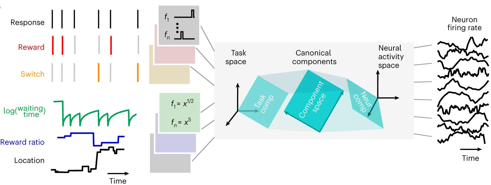

## Motivations

With the advent of new technologies, we neuroscientists now have exciting opportunities to probe the brain by recording the activity of tens, hundreds, or even thousands of neurons simultaneously. Beyond just neural recordings, we are increasingly able to quantify behavior in rich and complex ways—ranging from motion tracking to acoustic profiling and many others.

Systems neuroscientists are strongly interested in understanding how the brain generates and controls behavior. This is probably the most exciting time to be in the field of neuroscience—and it will likely only get more exciting.

However, one major challenge we face is making sense of these enormous high-dimensional datasets—namely, finding meaningful relationships between brain activity and behavior when both exist in complex, high-dimensional spaces. To this end, many researchers have developed or adapted analytical frameworks to help answer questions in neuroscience.

CCA is one such example and is a matrix factorization technique that connects two data matrices. CCA finds rotation matrices (set of projection vectors) for individual data matrices such that the two datasets are maximally correlated in the projected subspace (canonical component space). Below is a schematic inspired by [Shahidi et al., 2024][shahidi_et_al_2024].

*A schematic of CCA (From Shahidi et al., 2024)*

The use of CCA has been increasing in recent studies. For example, [Shahidi et al., 2024][shahidi_et_al_2024] uses CCA to find relationships between neural activity in the prefrontal cortex and behavioral variables in freely moving animals. [Hira et al., 2024][hira_et_al_2024] applied CCA between neural activities two different brain areas.

## Refreshing on Matrix Factorization

*Skip this section if you are already comfortable with PCA, especially if you have good intuition about the implications of running PCA on a data matrix and its transpose.*

### What is Matrix Factorization?

A general understanding of **matrix factorization** will be helpful for understanding how CCA works and how to interpret it. I’ll briefly touch on this with principal component analysis (PCA) as an example.

Matrix factorization is a general technique in linear algebra where a given matrix is decomposed (or 'factored') into a product of two or more matrices. The idea is to represent (or approximate) the original data in a way that is useful—for example, to reveal hidden structure, reduce dimensionality, or simplify computation.

Let’s consider a matrix of neural activity ($\mathbf{Y}$) consisting of $n$ neurons recorded over $T$ time points ($\mathbf{Y} \in \mathbb{R}^{N \times T}$). The core idea of matrix factorization is to approximate the data matrix as:

$$\mathbf{Y} \approx \mathbf{W} \mathbf{H}$$

Where:

- $\mathbf{W} \in \mathbb{R}^{N \times K}$
- $\mathbf{H} \in \mathbb{R}^{K \times T}$
- $K \ll \min(N, T)$ (usually, $K < N < T$ in datasets we deal with)

Using the obtained matrices ($\mathbf{W}$ and $\mathbf{H}$), we can reconstruct the original data:

$$\mathbf{Y} \approx \mathbf{W} \times \mathbf{H} = \mathbf{\tilde{Y}}$$

The reconstruction ($\mathbf{\tilde{Y}}$) is an approximation of the original data ($\mathbf{Y}$), but it now essentially lives in a $K$-dimensional subspace instead of the original $N$- or $T$-dimensional space.

There are a number of ways to achieve this factorization (i.e., to obtain $\mathbf{W}$ and $\mathbf{H}$), and each of them has pros and cons. Here, I will briefly introduce PCA, which is probably the most widely used matrix factorization technique in neuroscience data analysis.

### PCA as an Example Factorization Technique

Principal Component Analysis (PCA) is one of the most commonly used matrix factorization techniques in neuroscience. It is often applied to reduce the dimensionality of neural data while preserving as much of its structure (i.e., variance) as possible.

Let’s return to our neural dataset $\mathbf{Y} \in \mathbb{R}^{N \times T}$, where $N$ is the number of neurons and $T$ is the number of time points. PCA approximates $\mathbf{Y}$ as the product of two low-rank matrices:

$$
\mathbf{Y} \approx \mathbf{W} \mathbf{H}
$$

- $\mathbf{W} \in \mathbb{R}^{N \times K}$ contains the **neural loadings**—how strongly each neuron contributes to each component.
- $\mathbf{H} \in \mathbb{R}^{K \times T}$ contains the **principal components**—the time series of the latent dimensions.
- $K$ is the number of retained components (typically $K \ll N$ and $K \ll T$).

PCA can be understood through **two equivalent objectives**:

#### 1. Minimize Reconstruction Error

PCA finds the best low-rank approximation of the original data by minimizing the following reconstruction error:

$$
\min_{\mathbf{W}, \mathbf{H}} \left\| \mathbf{Y} - \mathbf{W} \mathbf{H} \right\|_F^2
$$

subject to the constraint that the columns of $\mathbf{W}$ are orthogonal (i.e., $\mathbf{W}^T\mathbf{W} = \mathbf{I}$). Here, $\|\cdot\|_F$ is the Frobenius norm, which measures total squared error across all entries. In this formation, $\mathbf{W}$ represents the principal directions (basis vectors), and $\mathbf{H} = \mathbf{W}^T\mathbf{Y}$ contains the low-dimensional representations of the data. A key property of PCA is that the components in $\mathbf{H}$ are uncorrelated---each dimension captures unique variance in the data.

#### 2. Maximize Projected Variance

Alternatively, PCA can be seen as finding directions (components) that capture the most variance in the data. Specifically, PCA solves:

$$
\max_{\mathbf{h}} \ \mathrm{Var}(\mathbf{Y}\mathbf{h})
$$

subject to: $\|\mathbf{h}\|_2 = 1$

This maximization seek a direction $\mathbf{h}$ such that the projection of the data onto $\mathbf{h}$ has the largest variance. Subsequent components are found by imposing orthogonality constraints to previous ones.

---
Both formulations lead to the same result: **a set of $K$ orthogonal components that explain the most variance possible** in the original dataset. To learn how these two ways are equivalent, check out [this blog post][PCA] by Alex-it's a great explanation.

PCA is often the first step in analyzing high-dimensional neural recordings, serving as a foundation for understanding population dynamics, uncovering latent structure, or feeding into downstream models.

## How CCA works - math
Now, we get under the hood of CCA.

Let's say an animal is moving between left and right parts of a room and receiving food at respective percentages that are changing over time. We may have Q behavioral features to focus on (e.g. speed, location (x, y), amount of received reward, etc.). During this behavioral observation, we may record activity of $P$ neurons over $T$ time points. We now have a data matrix for neural activity ($\mathbf{X} \in \mathbb{R}^{T \times P}$) and behavioral data ($\mathbf{Y} \in \mathbb{R}^{T \times Q}$).

- $\mathbf{X} \in \mathbb{R}^{T \times P}$: neural data matrix ($T$ timebins, $P$ neurons)
- $\mathbf{Y} \in \mathbb{R}^{T \times Q}$: behavioral data matrix ($T$ timebins, $Q$ behavioral features)

Our goal is to find basis vectors, respectively for the two matrices that maximize the activities.

Let:

$$\mathbf{z_X}=\mathbf{X}\mathbf{a}\in\mathbb{R}^{T}$$
$$\mathbf{z_Y}=\mathbf{Y}\mathbf{b}\in\mathbb{R}^{T}$$

where $\mathbf{a}$ and $\mathbf{b}$ are basis vectors for $\mathbf{X}$, $\mathbf{Y}$, respectively. We want to find $\mathbf{a}$ and $\mathbf{b}$ such that the projections $\mathbf{z_X}$ and $\mathbf{z_Y}$› are maximally correlated.

Hence,

$$\max\rho = {\Sigma_{\mathbf{z_X}\mathbf{z_Y}}\over {\sqrt{Var(\mathbf{z_X})}\sqrt{Var(\mathbf{z_Y})}}} = {\mathbf{z_X}^T\mathbf{z_Y} \over {\sqrt{||\mathbf{z_X}||^2}\cdot\sqrt{||\mathbf{z_Y}||^2}}}$$

We also constrain $||\mathbf{z_X}||^2=||\mathbf{z_Y}||^2=1$ because the correlation of $\mathbf{z_X}$ and $\mathbf{z_Y}$ does not change with scaling of them. In other wise, without this constraint, the norm of $\mathfb{a}$ and $\mathfb{b}$ can be arbitrarily long and the solution will not be unique.

We solve:
$$\max_{\mathbf{a}, \mathbf{b}} \mathbf{a}^T\mathbf{X}^T\mathbf{Y}\mathbf{b}$$
with subject to:

$$\mathbf{a}^T\mathbf{X}^T\mathbf{X}\mathbf{a} = \mathbf{b}^T\mathbf{Y}^T\mathbf{Y}\mathbf{b} = 1$$

### Solving the objective function
As a first step, we replace $a$ and $b$ with the following (seems out of nowhere, but we'll see why it's useful in subsequent steps.):

$$\mathbf{a} = (\mathbf{X}^T\mathbf{X})^{-1/2}\mathbf{\tilde{a}}$$
$$\mathbf{b} = (\mathbf{Y}^T\mathbf{Y})^{-1/2}\mathbf{\tilde{b}}$$

Then our problem is now,
$$\max_{\tilde{a}, \tilde{b}} \tilde{a}^T(\mathbf{X}^T\mathbf{X})^{-1/2}\mathbf{X}^T\mathbf{Y}(\mathbf{Y}^T\mathbf{Y})^{-1/2}\tilde{b}$$
with subject to:

$$\mathbf{\tilde{a}}^T\mathbf{\tilde{a}} = \mathbf{\tilde{b}}^T\mathbf{\tilde{b}} = 1$$

Now, we notice that as the whitened matrices[^1] of $\mathbf{X}$ and $\mathbf{Y}$ are $\mathbf{\tilde{X}}=\mathbf{X}(\mathbf{X}^T\mathbf{X})^{-1/2}$, $\mathbf{\tilde{Y}}=\mathbf{Y}(\mathbf{Y}^T\mathbf{Y})^{-1/2}$, respectively.

Therefore,
$$\max_{\mathbf{\tilde{a}}, \mathbf{\tilde{b}}} \mathbf{\tilde{a}}^T\mathbf{\tilde{X}}^T\mathbf{\tilde{Y}}\mathbf{\tilde{b}}$$
with subject to:

$$\mathbf{\tilde{a}}^T\mathbf{\tilde{a}} = \mathbf{\tilde{b}}^T\mathbf{\tilde{b}} = 1$$

We perform singular value decomposition (SVD) on the cross-covariance matrix of the whitened matrices ($\mathbf{\tilde{X}}^T\mathbf{\tilde{Y}} = \mathbf{U}\mathbf{\Lambda} \mathbf{V}^T$).

$$\max_{\mathbf{\tilde{a}}, \mathbf{\tilde{b}}} \mathbf{\tilde{a}}^T\mathbf{U}\mathbf{\Lambda} \mathbf{V}^T\mathbf{\tilde{b}}$$
with subject to:
$$\mathbf{\tilde{a}}^T\mathbf{\tilde{a}} = \mathbf{\tilde{b}}^T\mathbf{\tilde{b}} = 1$$

Let's look into the elements.

$$\mathbf{\tilde{a}}^T\mathbf{U}\mathbf{\Lambda} \mathbf{V}^T\mathbf{\tilde{b}}$$

$$=\mathbf{\tilde{a}}^T\mathbf{U}\mathbf{\Lambda} \mathbf{V}^T\mathbf{\tilde{b}}$$

$$=\mathbf{\tilde{a}}^T
\begin{bmatrix} \mathbf{u}_1 & \mathbf{u}_2 & \cdots & \mathbf{u}_P \end{bmatrix}
\left[
\begin{array}{cccc}
\sigma_1 & 0 & \cdots & 0 \\
0 & \sigma_2 & \cdots & 0 \\
\vdots & \vdots & \ddots & \vdots \\
0 & 0 & \cdots & \sigma_Q \\
0 & 0 & \cdots & 0 \\
\vdots & \vdots & & \vdots \\
0 & 0 & \cdots & 0
\end{array}
\right]
\begin{bmatrix}
\mathbf{v}_1^\top \\
\mathbf{v}_2^\top \\
\vdots \\
\mathbf{v}_Q^\top
\end{bmatrix}
\mathbf{\tilde{b}}
$$

$$=\begin{bmatrix} \mathbf{\tilde{a}}^T\mathbf{u}_1 & \mathbf{\tilde{a}}^T\mathbf{u}_2 & \cdots & \mathbf{\tilde{a}}^T\mathbf{u}_P \end{bmatrix}
\left[
\begin{array}{cccc}
\sigma_1 & 0 & \cdots & 0 \\
0 & \sigma_2 & \cdots & 0 \\
\vdots & \vdots & \ddots & \vdots \\
0 & 0 & \cdots & \sigma_Q \\
0 & 0 & \cdots & 0 \\
\vdots & \vdots & & \vdots \\
0 & 0 & \cdots & 0
\end{array}
\right]
\begin{bmatrix}
\mathbf{v}_1^T\tilde{b} \\
\mathbf{v}_2^T\tilde{b} \\
\vdots \\
\mathbf{v}_Q^T\tilde{b}
\end{bmatrix}
$$

$$=\begin{bmatrix}
\cos\theta_1 & \cos\theta_2 & \cdots & cos\theta_P
\end{bmatrix}
\left[
\begin{array}{cccc}
\sigma_1 & 0 & \cdots & 0 \\
0 & \sigma_2 & \cdots & 0 \\
\vdots & \vdots & \ddots & \vdots \\
0 & 0 & \cdots & \sigma_Q \\
0 & 0 & \cdots & 0 \\
\vdots & \vdots & & \vdots \\
0 & 0 & \cdots & 0
\end{array}
\right]
\begin{bmatrix}
\cos\phi_1 \\
\cos\phi_2 \\
\vdots \\
\cos\phi_Q
\end{bmatrix}
$$

$$=\sigma_1\cos\theta_1\cos\phi_1 + \sigma_2\cos\theta_2\cos\phi_2 + \cdots + \sigma_Q\cos\theta_Q\cos\phi_Q
$$

$$=\sum_{i=1}^r\sigma_i\cos\theta_i\cos\phi_i$$

Use the Cauchy-Schwarz inequality:

$$|\sum_{i=1}^r\sigma_i\cos\theta_i\cos\phi_i| \le (\sum_{i=1}^r\sigma_i^2)^{1/2}(\sum_{i=1}^r \cos^2\theta_i\cos^2\phi_i)^{1/2}
$$

But since $||\mathbf{\tilde{a}}|| = ||\mathbf{\tilde{b}}|| = 1$, we have:

$$
\sum_{i=1}^r \cos^2\theta_i\le1, \sum_{i=1}^r \cos^2\phi_i\le1
$$

is achieved when all the weight is on the largest $\sigma_1$ term, i.e.,

$$
\cos\theta_1 = \cos\phi_1 = 1
$$

That is, when:

$$
\mathbf{\tilde{a}} = \mathbf{u_1}, \mathbf{\tilde{b}} = \mathbf{v_1}
$$

$$
\mathbf{a_i} = (X^TX)^{-1/2}\mathbf{u_i}, \mathbf{b_i} = (Y^TY)^{-1/2}\mathbf{v_1}
$$

where $\lambda$ is the $i$th singular value - the $i$th canonical correlation.

### Solving the objective function - with Lagrangian multiplier
To solve the objective function, we want to encode both *the objective* ($\max_{\mathbf{a}, \mathbf{b}} \mathbf{a}^T\Sigma_{XY}\mathbf{b}$) and *the constraint* ($\mathbf{a}^T\Sigma_{XX}\mathbf{a} = 1, \mathbf{b}^T\Sigma_{YY}\mathbf{b} = 1$), we turn to *Lagrangian multiplier*.

---
#### Brief description of Lagrangian multiplier
Lagrangian multiplier is a strategy for finding the maxima and minima of a function subject to equation constraints.

$$def: L(x, \lambda) \equiv f(x) + \lambda g(x)$$

where $f(x)$ is the objective function, $\lambda$ is the Lagrangian multiplier, and $g(x)$ is the constraint.
In order to find maximum (or minimum) of $f(x)$, subject to $g(x)=0$, find the *stationary point of $L(x, y)$ considered as a function of $x$, $\lambda$*. => all partial derivatives should be 0.

---

Back to our data. In our case, as we have two constraints ($a^T\Sigma_{XX}a = 1, b^T\Sigma_{YY}b = 1$), we have two Lagrangian multipliers: $\lambda_1$ and $\lambda_2$.

$$L(a, b, \lambda_1, \lambda_2) = a^T\Sigma_{XY}b - {\lambda_1\over2}(a^T\Sigma_{XX}a-1) - {\lambda_2\over2}(b^T\Sigma_{YY}b-1)$$

Derivative with respect to a:

$${\delta L\over{\delta{a}}} = {\delta\over{\delta{a}}}(a^T\Sigma_{XY}b) - {\delta\over{\delta{a}}}({\lambda_1\over2}(a^T\Sigma_{XX}a-1)) - {\delta\over{\delta{a}}}({\lambda_2\over2}(b^T\Sigma_{YY}b-1))$$
$$= \Sigma_{XY}b - \lambda_1\Sigma_{XX}a = 0$$
Use the vector derivative rules: ${\delta\over \delta x}x^TAy = Ay$, ${\delta\over \delta x}x^TAx = 2Ax$ for the first and the second terms, respectively. The third term goes 0 as there is no $a$.
$$\Sigma_{XY}b = \lambda_1\Sigma_{XX}a \dots (1)$$

Similarity, we compute the derivative w.r.t. b:
$${\delta L\over{\delta{b}}} = {\delta\over{\delta{b}}}(a^T\Sigma_{XY}b) - {\delta\over{\delta{b}}}({\lambda_1\over2}(a^T\Sigma_{XX}a-1)) - {\delta\over{\delta{b}}}({\lambda_2\over2}(b^T\Sigma_{YY}b-1))$$
$$= \Sigma_{YY}a - \lambda_2\Sigma_{YY}b = 0$$
Use the vector derivative rules: ${\delta\over \delta x}y^TAx = A^Ty$, ${\delta\over \delta x}x^TAx = 2Ax$ for the first and the third terms, respectively. The second term goes 0 as there is no $a$.
$$\Sigma_{YX}a = \lambda_2\Sigma_{YY}b \dots (2)$$

Take transpose of equation $(1)$, post-multiply by $a$:
$$b^T\Sigma_{YX}a=\lambda_1a^T\Sigma_{XX}a$$

Take equation $(2)$, and pre-multiply by $b^T$:
$$b^T\Sigma_{YX}a = \lambda_2b^T\Sigma_{YY}b$$

As we have the constraints $a^T\Sigma_{XX}a = 1, b^T\Sigma_{YY}b = 1$:
$$\lambda_1 = b^T\Sigma_{YX}a = \lambda_2$$

Let:
$$\lambda = \lambda_1 = \lambda_2$$

Now, take $(2)$, assume $\Sigma_{YY}$ is invertible:
$$b = {1\over{\lambda}}\Sigma_{YY}^{-1}\Sigma_{YX}a \dots (3)$$

Plug $(2)$ into $(1)$:
$$\Sigma_{XY}({1\over{\lambda}}\Sigma_{YY}^{-1}\Sigma_{YX}a) = \lambda\Sigma_{XX}a$$
$$(\Sigma_{XY}\Sigma_{YY}^{-1}\Sigma_{YX})a = \lambda^2\Sigma_{XX}a \dots (3)$$

$(3)$ is **generalized eigenvalue problem**!!

Now, we can solve this for eigenvalues $\lambda^2$ and eigenvectors $a$. Once obtaining $a$ and $\lambda$, we can inject them to $(3)$ to obtain $b$.

## Pros and Cons of CCA

## How is CCA related to PCA

## "Row" and "Column" Views of Matrix Multiplication

After running a matrix factorization algorithm (PCA, NMF, etc.), we obtain a reconstruction ($\mathbf{\tilde{Y}}$) of the original data ($\mathbf{Y}$), represented as the product of two matrices ($\mathbf{W}$ and $\mathbf{H}$), which ideally yields useful insight:

$$\mathbf{\tilde{Y}} \approx \mathbf{W} \times \mathbf{H} = \mathbf{Y}$$

While the exact interpretation depends on the method and nature of your data, I’ll describe two useful ways to interpret the resulting matrices, which I learned in an excellent class taught by [Alex Williams][AHW].

### 1. Column View

Let’s start with the **column view**. Here, we think about how the column vectors of $\mathbf{\tilde{Y}}$ are represented with respect to the components (factors) obtained from matrix factorization. Each column vector corresponds to the activity of $N$ neurons at a single time point (e.g., time point $t$, as in Figure 1A). Since each is an $N$-dimensional vector, we imagine an $N$-dimensional space (Figure 1B). However, we find that all data points (i.e., column vectors of $\mathbf{\tilde{Y}}$) lie on a $K$-dimensional plane (subspace) spanned by the column vectors of $\mathbf{W}$. These data points over time (from $t = 1$ to $T$) can be seen as *"population activity of $N$ neurons evolving on a $K$-dimensional subspace spanned by the column vectors of $\mathbf{W}$."*

### 2. Row View

Now let’s shift to the **row view**, focusing on the row vectors of $\mathbf{\tilde{Y}}$—that is, the temporal dynamics of individual neurons. A row vector ($\mathbf{Y}[n, :]$ for neuron $n$) is a $T$-dimensional vector. We again find that all these vectors lie on a $K$-dimensional subspace, this time spanned by the row vectors of $\mathbf{H}$. In neuroscience terms, this means *"temporal dynamics of individual neurons live on a $K$-dimensional subspace spanned by the rows of $\mathbf{H}$."* For neuron $n$, its activity over time is a linear combination of the temporal components (the rows of $\mathbf{H}$), with weights given by $\mathbf{W}[n, :]$.

Another useful perspective is that the "row" and "column" views are connected via transposition. Suppose we transpose both sides of the equation:

$$\mathbf{H}^{T} \times \mathbf{W}^{T} = \mathbf{\tilde{Y}}^{T}$$

Remember that ${(\mathbf{W} \times \mathbf{H})}^{T} = \mathbf{H}^{T} \times \mathbf{W}^{T}$. As shown in Figure 1E, we can interpret the transposed view similarly to the original row view (Figure 1C and D), but now from the "column" perspective. When using matrix factorization tools (e.g., `sklearn.decomposition.PCA` in Python or `pca` in MATLAB), each function handles the input matrix in its own way—so you may need to transpose your data to obtain the interpretation you want.

*Figure 1. 'Row' and 'column' views of matrix multiplication.*

## How CCA works - overview
Broadly speaking, Canonical Correlation Analysis (CCA) is a method for **finding basis vectors in two datasets such that the resulting projections are maximally correlated**. Suppose you have a matrix of neural activity (e.g., firing rates of many neurons over time) and another matrix of behavioral variables (e.g., the animal’s position over time). CCA identifies pairs of linear combinations—one from each dataset—such that the projected variables are as correlated as possible.

In what follows, I’ll explain the method by connecting it to the general framework of matrix factorization and by comparing it with Principal Component Analysis (PCA).

## Exmaple use cases in neuroscience research
### Prefrontal cortex of monkeys during decision making (~ et al., 20XX)

### Basal ganglia of songbird and their acoustic features

### adadasda

## Caveats

## TL'DR

## Further readings

## References

Let:

- $\mathbf{X}_p \in \mathbb{R}^{T \times P}$: neural data matrix ($T$ timebins, $P$ neurons)
- $\mathbf{X}_q \in \mathbb{R}^{T \times Q}$: behavioral data matrix ($T$ timebins, $Q$ behavioral features)

CCA finds weight matrices $\mathbf{W}_p \in \mathbb{R}^{P \times K}$, $\mathbf{W}_q \in \mathbb{R}^{Q \times K}$ such that the projections:

$$
\mathbf{H}_p = \mathbf{X}_p \mathbf{W}_p, \quad \mathbf{H}_q = \mathbf{X}_q \mathbf{W}_q
$$

maximize the correlation between corresponding columns of $\mathbf{H}_p$ and $\mathbf{H}_q$.

For the first canonical pair:

$$
\max_{\mathbf{w}_p, \mathbf{w}_q} \ \frac{\mathbf{w}_p^\top \mathbf{\Sigma}_{pq} \mathbf{w}_q}
{\sqrt{\mathbf{w}_p^\top \mathbf{\Sigma}_{pp} \mathbf{w}_p} \cdot \sqrt{\mathbf{w}_q^\top \mathbf{\Sigma}_{qq} \mathbf{w}_q}}
$$

Where:

- $\mathbf{\Sigma}_{pp} = \frac{1}{T - 1} \mathbf{X}_p^\top \mathbf{X}_p$
- $\mathbf{\Sigma}_{qq} = \frac{1}{T - 1} \mathbf{X}_q^\top \mathbf{X}_q$
- $\mathbf{\Sigma}_{pq} = \frac{1}{T - 1} \mathbf{X}_p^\top \mathbf{X}_q$

Each subsequent canonical direction is computed subject to orthogonality constraints with previous directions.

### Footnotes
[^1]: whitening

[shahidi_et_al_2024]: https://doi.org/10.1038/s41593-024-01575-w
[hira_et_al_2024]: https://www.biorxiv.org/content/10.1101/2023.08.27.555017v2
[AHW]: https://alexhwilliams.info/
[PCA]: https://alexhwilliams.info/itsneuronalblog/2016/03/27/pca/